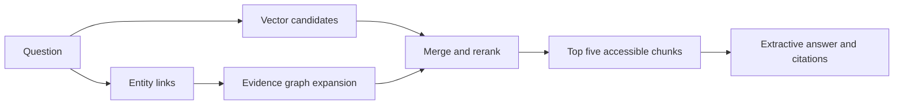

# GraphRAG Evidence Retrieval

This project tests whether an evidence-linked entity graph helps retrieve both documents needed for multi-hop questions. A vector index supplies initial chunks. The graph links entities to source chunks, expands up to two hops, and merges the retrieved evidence within a fixed five-chunk context budget. Every returned relation points back to a source chunk. Access checks run before graph traversal and again against the current document ACL.

The runnable service is local and in memory. It has no answer cache or model router. The co-occurrence graph is a transparent offline fixture; it is not a claim of production-grade knowledge graph extraction.



## Run

From this directory, with Python 3.11 or newer and [uv](https://docs.astral.sh/uv/):

```bash
uv run --extra dev pytest -q
uv run --extra dev python scripts/run_hotpot_eval.py --reranker lexical --output results/vector.csv
uv run --extra dev python scripts/run_hotpot_eval.py --graph cooccurrence --reranker lexical --output results/graph.csv
```

The repository includes a frozen sample of 150 [HotpotQA](https://hotpotqa.github.io/) distractor development questions and 1,481 unique context paragraphs. The builder can regenerate it from the source validation Parquet:

```bash
uv run --extra benchmark python scripts/build_hotpot_sample.py data/hotpot_validation.parquet data/hotpot_sample --count 150
```

The input used here came from the [HotpotQA Hugging Face mirror](https://huggingface.co/datasets/hotpotqa/hotpot_qa). Its SHA-256 is `c20b638ca82b21d04fe12e14ff417ad05153d4d215a65de54497fca4e972f7c6`. The sample preserves gold answers and supporting fact labels only in evaluation records; they are not indexed. It selects question IDs deterministically and balances 75 bridge and 75 comparison questions. The included HotpotQA data is covered by [CC BY-SA 4.0](data/hotpot_sample/LICENSE.md), with attribution and transformation details in that file.

For a stronger embedding comparison, run the paired commands with the optional semantic dependency:

```bash
uv run --extra semantic python scripts/run_hotpot_eval.py --embedder sentence-transformer --reranker lexical --output results/vector-semantic.csv
uv run --extra semantic python scripts/run_hotpot_eval.py --graph cooccurrence --embedder sentence-transformer --reranker lexical --output results/graph-semantic.csv
```

The default semantic adapter uses `sentence-transformers/all-MiniLM-L6-v2`. The `--model` option accepts a LiteLLM model ID if the `llm` extra and provider credentials are configured. The default `extractive-demo` generator only selects a source sentence and cannot synthesize multi-hop answers.

## Measured results

These are paired runs on the same frozen 150 questions and union corpus. Each indexed chunk includes its document title and paragraph text, so both arms can use titles. Each arm sends at most 25 authorized candidates through the same lexical reranker, then supplies its top five chunks to the same extractive generator. The vector arm takes its candidates from vector search. The graph arm takes five vector candidates and up to 20 graph candidates. No slot is reserved for graph evidence. The complete summaries and a code-and-input fingerprint are in `results/fixed_*.json`.

| Embedder and retrieval | Supporting-document recall | Both support documents retrieved | Answer F1 |
| --- | ---: | ---: | ---: |
| Hashing vector | 0.447 | 0.193 | 0.0499 |
| Hashing vector + co-occurrence graph | 0.580 | 0.307 | 0.0507 |
| Semantic vector | 0.687 | 0.440 | 0.0498 |
| Semantic vector + co-occurrence graph | 0.683 | 0.453 | 0.0543 |

On this sample, graph expansion raised supporting-document recall by **13.3 percentage points** with hashing embeddings. It helped 44 questions, harmed nine, and tied on 97. With semantic embeddings, recall fell by **0.3 percentage points**: 16 helped, 15 harmed, and 119 tied. Answer F1 stayed near 0.05 and exact match was zero in all four runs. The extractive generator cannot synthesize a multi-hop answer, so retrieval gains are not answer-quality gains. The graph arm also took longer locally: median latency was 42.1 ms versus 13.7 ms for hashing, and 53.6 ms versus 16.5 ms for semantic embeddings. These timings depend on the machine and are not deployment benchmarks.

The sample's gold support labels are used only by evaluation. Graph linking uses a catalog of titles from the indexed corpus, and its co-occurrence edges can admit distractors. Answer F1 and exact match use this project's simple token normalization, not the official HotpotQA scorer. These descriptive results from one fixed sample do not establish a general performance advantage.

The semantic model is named but its weights revision is not pinned or included in the result fingerprint. Pin that revision before comparing semantic runs across machines.

## Design and limits

- `rag_graph.graph.EvidenceGraph` stores entity mentions and relations with source chunk IDs. `remove_chunk` invalidates stale edges after re-ingestion and advances the graph revision.
- `rag_graph.graph_extraction` contains the co-occurrence fixture and an optional LiteLLM relation extractor constrained to a fixed predicate schema. Structured extraction has not been evaluated on this benchmark.
- `rag_graph.service.GraphRAGService` combines vector and graph evidence, filters by current permissions, generates an answer, and rejects citations outside the authorized context.
- The graph is in memory, has no Neo4j persistence, and uses heuristic entity linking. Both paired benchmarks were rerun in this standalone project with equal candidate ceilings and no graph slot reservation.

The honest portfolio claim today is a **measured retrieval experiment with a documented failure mode**. A claim about improved multi-hop answer quality would require structured relations and a paired evaluation with a capable answer model.

Related projects: [permission-aware multi-tenant RAG](https://github.com/Sankew/secure-multitenant-rag) and [answer caching and model routing](https://github.com/Sankew/rag-cache-model-routing).
